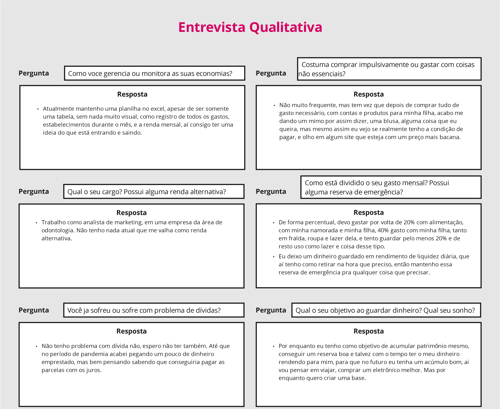
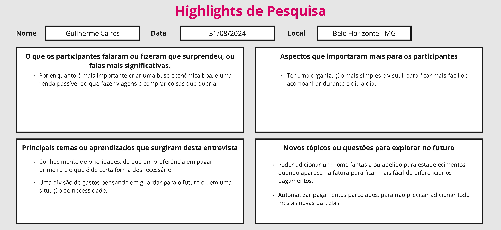
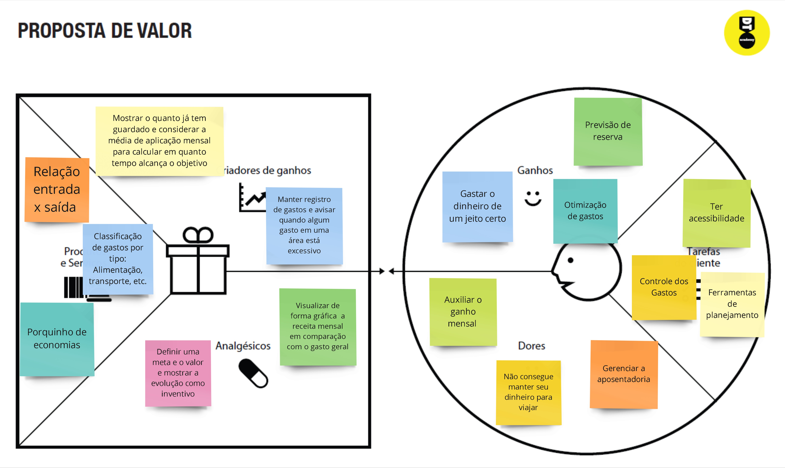
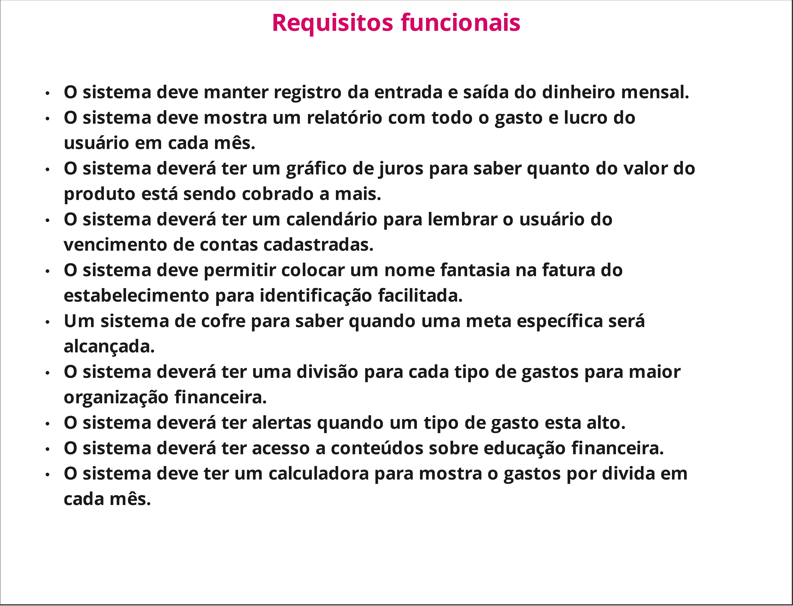

# Introdução

Informações básicas do projeto.

* **Projeto:**  Descontrole financeiro
* **Repositório GitHub:** https://github.com/ICEI-PUC-Minas-PMGCC-TI/ti-1-ppl-cc-m-20242-organizacao-financeira
* **Membros da equipe:**

  * Alessandro Andrade de Oliveira(https://github.com/fulano) ⚠️ EXEMPLO ⚠️
  * Pedro Henrique Cardoso Maia https://github.com/pedro-maia1337
  * André Almeida Costa https://github.com/And-30
  * Samuel Padua Ramos https://github.com/samuelpr0
  * Davi Manoel Bernardes https://github.com/DaviManoelB
  * Tiago Santos Nogueira https://github.com/TiagoSNogueira
  * Felipe Quites Lopes https://github.com/FelipeQLopes
  

A documentação do projeto é estruturada da seguinte forma:

1. Introdução
2. Contexto
3. Product Discovery
4. Product Design
5. Metodologia
6. Solução
7. Referências Bibliográficas


# Contexto

## Problema

**✳️✳️✳️ COLOQUE AQUI O SEU TEXTO ✳️✳️✳️**

> ⚠️ **APAGUE ESSA PARTE ANTES DE ENTREGAR SEU TRABALHO**
>
> Nesse momento você deve apresentar o problema que a sua aplicação deve resolver. No entanto, não é a hora de comentar sobre a aplicação. Descreva também o contexto em que essa aplicação será usada, se houver: empresa, tecnologias, etc. Novamente, descreva apenas o que de fato existir, pois ainda não é a hora de apresentar requisitos detalhados ou projetos.
>
> **Orientações**:
>
> - [Objetivos, Problema de pesquisa e Justificativa](https://medium.com/@versioparole/objetivos-problema-de-pesquisa-e-justificativa-c98c8233b9c3)
> - [Matriz Certezas, Suposições e Dúvidas](https://medium.com/educa%C3%A7%C3%A3o-fora-da-caixa/matriz-certezas-suposi%C3%A7%C3%B5es-e-d%C3%BAvidas-fa2263633655)
> - [Brainstorming](https://www.euax.com.br/2018/09/brainstorming/)

## Objetivos

O objetivo desse aplicativo e ajudar pessoas que tem dificuldade para gerenciar suas finanças.

**✳️✳️✳️ COLOQUE AQUI O SEU TEXTO ✳️✳️✳️**

> ⚠️ **APAGUE ESSA PARTE ANTES DE ENTREGAR SEU TRABALHO**
>
> Aqui você deve descrever os objetivos do trabalho indicando que o objetivo geral é desenvolver um software para solucionar o problema apresentado acima. Apresente também alguns (pelo menos 2) objetivos específicos dependendo de onde você vai querer concentrar a sua prática investigativa, ou como você vai aprofundar no seu trabalho.
>
> **Orientações**:
>
> - [Objetivo geral e objetivo específico: como fazer e quais verbos utilizar](https://blog.mettzer.com/diferenca-entre-objetivo-geral-e-objetivo-especifico/)

## Justificativa

**✳️✳️✳️ COLOQUE AQUI O SEU TEXTO ✳️✳️✳️**

> ⚠️ **APAGUE ESSA PARTE ANTES DE ENTREGAR SEU TRABALHO**
>
> Descreva a importância ou a motivação para trabalhar com esta aplicação que você escolheu. Indique as razões pelas quais você escolheu seus objetivos específicos ou as razões para aprofundar em certos aspectos do software.
>
> O grupo de trabalho pode fazer uso de questionários, entrevistas e dados estatísticos, que podem ser apresentados, com o objetivo de esclarecer detalhes do problema que será abordado pelo grupo.
>
> **Orientações**:
>
> - [Como montar a justificativa](https://guiadamonografia.com.br/como-montar-justificativa-do-tcc/)

## Público-Alvo

**✳️✳️✳️ COLOQUE AQUI O SEU TEXTO ✳️✳️✳️**

> ⚠️ **APAGUE ESSA PARTE ANTES DE ENTREGAR SEU TRABALHO**
>
> Descreva quais são as pessoas que usarão a sua aplicação indicando os diferentes perfis. A ideia é, dentro do possível, conhecer um pouco mais sobre o perfil dos usuários: conhecimentos prévios, relação com a tecnologia, relações hierárquicas, etc.
>
> Adicione informações sobre o público-alvo por meio de uma descrição textual, ou diagramas de personas, mapa de stakeholders, ou como o grupo achar mais conveniente.
>
> **Orientações**:
>
> - [Público-alvo: o que é, tipos, como definir seu público e exemplos](https://klickpages.com.br/blog/publico-alvo-o-que-e/)
> - [Qual a diferença entre público-alvo e persona?](https://rockcontent.com/blog/diferenca-publico-alvo-e-persona/)

# Product Discovery

## Etapa de Entendimento

**✳️✳️✳️ APRESENTE OS ARTEFATOS DA ETAPA  ✳️✳️✳️**


> * **Matriz CSD**: também conhecida por Matriz de Alinhamento, é uma ferramenta utilizada no Design Thinking para organizar informações e facilitar o processo de tomada de decisão e solução de problemas.
>

> * **Mapa de stakeholders**: ferramenta que nos permite compreender o grupo de pessoas e entidades que devemos estudar e conversar para entender mais sobre o problema.
> 

> * **Entrevistas qualitativas**: série de entrevistas qualitativas para validar suposições e solucionar as dúvidas com as principais pessoas envolvidas;
>  

   
   
   
   
   
   
> * **Highlights de pesquisa**: um compilado do levantamento realizado por meio das entrevistas.
> 
>  

   
   
   
   
   

## Etapa de Definição

### Personas

## Persona 1
 

 ## Persona 2
 

 ## Persona 3
 

# Product Design

## Histórias de Usuários

Com base na análise das personas foram identificadas as seguintes histórias de usuários:

| EU COMO                                                        | QUERO/PRECISO                                     | PARA                                                              |
| -------------------------------------------------------------- | --------------------------------------            | ----------------------------------------------------------------- |
| Alguém que sofre com dívidas                                   | Lembretes de vencimento de contas                 | Evitar pagar juros não essenciais                                 |
| Alguém que não tem muito tempo                                 | Painel de fluxo de caixa com relatórios visuais   | Gastar menos tempo organizando minhas finanças                    |
| Alguém desorganizado                                           | Painel de fluxo de caixa com gastos classificados | Saber as minhas maiores fontes de gastos                          |
| Alguém sem conhecimento de finanças pessoais                   | Dicas e aulas sobre finanças                      | Viver uma vida confortavel sem se preocupar com dinheiro          |
| Alguém que compra muito parcelado                              | Gráfico com o valor dos juros mensais             | Saber quanto estou gastando a mais em um produto                  |
| Alguém que quer viajar                                         | Registro de quanto estou juntando                 | Saber em quanto tempo vou ter o dinheiro suficiente               |
| Alguém que gastar valores muitos altos                         | Registrar quando gasta muito                      | Alerta quando o gasto esta muito alto                             |
| Usa muito cartão                                               | Colocar apelidos nos estabelecimentos na fatura   | Identificar de forma mais fácil na fatura qual foi o gasto e onde |
| Quero registrar e categorizar meus gastos diários facilmente   |Ferramentas de controle                            | Poder ter um maior controle do gasto mensal                       |

## Proposta de Valor

## Proposta da Persona 1


## Proposta da Persona 2


## Proposta da Persona 3


## Requisitos

As tabelas que se seguem apresentam os requisitos funcionais e não funcionais e restrições que detalham o escopo do projeto.

### Requisitos Funcionais



| ID      | Descrição dos Requisitos                                                                                                | Prioridade|
| ------  | ----------------------------------------------------------------------------------------------------------------------|-----------|
| RF-001  | O sistema deverá manter registro da entrada e saída do dinheiro mensal                                                | ALTA      |
| RF-002  | O sistema deverá mostra um relatório com todo o gasto e lucro do usuário em cada mês                                  | ALTA      |
| RF-003  | O sistema deverá ter um grafico de juros para saber quanto do valor do produto está sendo cobrado a mais              | MÉDIA     |
| RF-004  | O sistema deverá ter um calendário para lembrar o usuário do vencimento de contas cadastradas                         | ALTA      |
| RF-005  | O sistema deverá permitir colocar um nome fantasia na fatura do estabelecimento para ter uma identificação facilitada | MÉDIA     |
| RF-006  | Um sistema de cofre para saber quando uma meta específica será alcançada                                              | MÉDIA     |
| RF-007  | O sistema deverá ter uma divisão para cada tipo de gastos para maior organização financeira                           | ALTA      |
| RF-008  | O sitema deverá ter alertas quando um tipo de gasto esta alto                                                         | MÉDIA     |
| RF-009  | O sitema deverá ter acesso a conteúdos sobre educação financeira                                                      | MÉDIA     |
| RF-010  | O sistema deverá ter uma calculadora para mostra o gastos pro divida em cada mês.                                     | MÉDIA     |

### Requisitos não Funcionais


| ID      | Descrição dos Requisitos Não Funcionais                                                                       | Prioridade |
| ------- | ------------------------------------------------------------------------------------------------------------- | ---------- |
| RNF-001 | O aplicativo deve estar disponível tanto para versão web quanto para versão mobile                            | MÉDIA      |
| RNF-002 | O aplicativo deve ser capaz decarregar a página principal com resumo financeiro do usuário en até 2 segundos  | MÉDIA      |


### Restrições do Projeto


| ID      | Descrição das Restrições                                                                        | Prioridade |
| ------- | ----------------------------------------------------------------------------------------------- | ---------- |
| RE-001  | O usuário só pode criar um número limitado de categorias de gastos (por exemplo, no máxomp 30)  | MÉDIA      |
| RE-002  | O aplicativo pode impor uma restrição de gasto diário                                           | MÉDIA      |

## Projeto de Interface

Artefatos relacionados com a interface e a interacão do usuário na proposta de solução.

### Wireframes

Estes são os protótipos de telas do sistema.

**✳️✳️✳️ COLOQUE AQUI OS PROTÓTIPOS DE TELAS COM TÍTULO E DESCRIÇÃO ✳️✳️✳️**

##### TELA XPTO ⚠️ EXEMPLO ⚠️

Descrição para a tela XPTO


> ⚠️ **APAGUE ESSA PARTE ANTES DE ENTREGAR SEU TRABALHO**
>
> Wireframes são protótipos das telas da aplicação usados em design de interface para sugerir a estrutura de um site web e seu relacionamentos entre suas páginas. Um wireframe web é uma ilustração semelhante ao layout de elementos fundamentais na interface.
>
> **Orientações**:
>
> - [Ferramentas de Wireframes](https://rockcontent.com/blog/wireframes/)
> - [Figma](https://www.figma.com/)
> - [Adobe XD](https://www.adobe.com/br/products/xd.html#scroll)
> - [MarvelApp](https://marvelapp.com/developers/documentation/tutorials/)

### User Flow


***Para uma melhor visualização do User Flow acesse esse link: https://miro.com/app/board/uXjVLdtXMKg=/

### Protótipo Interativo

**✳️✳️✳️ COLOQUE AQUI UM IFRAME COM SEU PROTÓTIPO INTERATIVO ✳️✳️✳️**

✅ [Protótipo Interativo (MarvelApp)](https://marvelapp.com/prototype/4hd6091?emb=1&iosapp=false&frameless=false)  ⚠️ EXEMPLO ⚠️

> ⚠️ **APAGUE ESSA PARTE ANTES DE ENTREGAR SEU TRABALHO**
>
> Um protótipo interativo apresenta o projeto de interfaces e permite ao usuário navegar pelas funcionalidades como se estivesse lidando com o software pronto. Utilize as mesmas ferramentas de construção de wireframes para montagem do seu protótipo interativo. Inclua o link para o protótipo interativo do projeto.

# Metodologia

Detalhes sobre a organização do grupo e o ferramental empregado.

## Ferramentas

Relação de ferramentas empregadas pelo grupo durante o projeto.

| Ambiente                    | Plataforma | Link de acesso                                                                         |
| --------------------------- | ---------- | -------------------------------------------------------------------------------------- |
| Processo de Design Thinking | Miro       | https://miro.com/app/board/uXjVKoWGKUQ=/                                               |
| Repositório de código       | GitHub     | https://github.com/ICEI-PUC-Minas-PMGCC-TI/ti-1-ppl-cc-m-20242-organizacao-financeira  |
| Hospedagem do site          | Render     | https://site.render.com/XXXXXXX ⚠️ EXEMPLO ⚠️                                         |
| Protótipo Interativo        | MarvelApp  | https://marvelapp.com/XXXXXXX ⚠️ EXEMPLO ⚠️                                           |
|                             |            |                                                                                        |

> ⚠️ **APAGUE ESSA PARTE ANTES DE ENTREGAR SEU TRABALHO**
>
> Liste as ferramentas empregadas no desenvolvimento do projeto, justificando a escolha delas, sempre que possível. Inclua itens como: (1) Editor de código, (2) )ferramentas de comunicação, (3) )ferramentas de diagramação, (4) )plataformas de hospedagem, entre outras.

## Gerenciamento do Projeto

Divisão de papéis no grupo e apresentação da estrutura da ferramenta de controle de tarefas (Kanban).


> ⚠️ **APAGUE ESSA PARTE ANTES DE ENTREGAR SEU TRABALHO**
>
> Nesta parte do documento, você deve apresentar  o processo de trabalho baseado nas metodologias ágeis, a divisão de papéis e tarefas, as ferramentas empregadas e como foi realizada a gestão de configuração do projeto via GitHub.
>
> Coloque detalhes sobre o processo de Design Thinking e a implementação do Framework Scrum seguido pelo grupo. O grupo poderá fazer uso de ferramentas on-line para acompanhar o andamento do projeto, a execução das tarefas e o status de desenvolvimento da solução.
>
> **Orientações**:
>
> - [Sobre Projects - GitHub Docs](https://docs.github.com/pt/issues/planning-and-tracking-with-projects/learning-about-projects/about-projects)
> - [Gestão de projetos com GitHub | balta.io](https://balta.io/blog/gestao-de-projetos-com-github)
> - [(460) GitHub Projects - YouTube](https://www.youtube.com/playlist?list=PLiO7XHcmTsldZR93nkTFmmWbCEVF_8F5H)
> - [11 Passos Essenciais para Implantar Scrum no seu Projeto](https://mindmaster.com.br/scrum-11-passos/)
> - [Scrum em 9 minutos](https://www.youtube.com/watch?v=XfvQWnRgxG0)

# Solução Implementada

Esta seção apresenta todos os detalhes da solução criada no projeto.

## Vídeo do Projeto

O vídeo a seguir traz uma apresentação do problema que a equipe está tratando e a proposta de solução. ⚠️ EXEMPLO ⚠️

[](https://www.youtube.com/embed/70gGoFyGeqQ)

> ⚠️ **APAGUE ESSA PARTE ANTES DE ENTREGAR SEU TRABALHO**
>
> O video de apresentação é voltado para que o público externo possa conhecer a solução. O formato é livre, sendo importante que seja apresentado o problema e a solução numa linguagem descomplicada e direta.
>
> Inclua um link para o vídeo do projeto.

## Funcionalidades

Esta seção apresenta as funcionalidades da solução.Info

##### Funcionalidade 1 - Cadastro de Contatos ⚠️ EXEMPLO ⚠️

Permite a inclusão, leitura, alteração e exclusão de contatos para o sistema

* **Estrutura de dados:** [Contatos](#ti_ed_contatos)
* **Instruções de acesso:**
  * Abra o site e efetue o login
  * Acesse o menu principal e escolha a opção Cadastros
  * Em seguida, escolha a opção Contatos
* **Tela da funcionalidade**:


> ⚠️ **APAGUE ESSA PARTE ANTES DE ENTREGAR SEU TRABALHO**
>
> Apresente cada uma das funcionalidades que a aplicação fornece tanto para os usuários quanto aos administradores da solução.
>
> Inclua, para cada funcionalidade, itens como: (1) titulos e descrição da funcionalidade; (2) Estrutura de dados associada; (3) o detalhe sobre as instruções de acesso e uso.

## Estruturas de Dados

Descrição das estruturas de dados utilizadas na solução com exemplos no formato JSON.Info

##### Estrutura de Dados - Contatos   ⚠️ EXEMPLO ⚠️

Contatos da aplicação

```json
  {
    "id": 1,
    "nome": "Leanne Graham",
    "cidade": "Belo Horizonte",
    "categoria": "amigos",
    "email": "Sincere@april.biz",
    "telefone": "1-770-736-8031",
    "website": "hildegard.org"
  }
  
```

##### Estrutura de Dados - Usuários  ⚠️ EXEMPLO ⚠️

Registro dos usuários do sistema utilizados para login e para o perfil do sistema

```json
  {
    id: "eed55b91-45be-4f2c-81bc-7686135503f9",
    email: "admin@abc.com",
    id: "eed55b91-45be-4f2c-81bc-7686135503f9",
    login: "admin",
    nome: "Administrador do Sistema",
    senha: "123"
  }
```

> ⚠️ **APAGUE ESSA PARTE ANTES DE ENTREGAR SEU TRABALHO**
>
> Apresente as estruturas de dados utilizadas na solução tanto para dados utilizados na essência da aplicação quanto outras estruturas que foram criadas para algum tipo de configuração
>
> Nomeie a estrutura, coloque uma descrição sucinta e apresente um exemplo em formato JSON.
>
> **Orientações:**
>
> * [JSON Introduction](https://www.w3schools.com/js/js_json_intro.asp)
> * [Trabalhando com JSON - Aprendendo desenvolvimento web | MDN](https://developer.mozilla.org/pt-BR/docs/Learn/JavaScript/Objects/JSON)

## Módulos e APIs

Esta seção apresenta os módulos e APIs utilizados na solução

**Images**:

* Unsplash - [https://unsplash.com/](https://unsplash.com/) ⚠️ EXEMPLO ⚠️

**Fonts:**

* Icons Font Face - [https://fontawesome.com/](https://fontawesome.com/) ⚠️ EXEMPLO ⚠️

**Scripts:**

* jQuery - [http://www.jquery.com/](http://www.jquery.com/) ⚠️ EXEMPLO ⚠️
* Bootstrap 4 - [http://getbootstrap.com/](http://getbootstrap.com/) ⚠️ EXEMPLO ⚠️

> ⚠️ **APAGUE ESSA PARTE ANTES DE ENTREGAR SEU TRABALHO**
>
> Apresente os módulos e APIs utilizados no desenvolvimento da solução. Inclua itens como: (1) Frameworks, bibliotecas, módulos, etc. utilizados no desenvolvimento da solução; (2) APIs utilizadas para acesso a dados, serviços, etc.

# Referências

As referências utilizadas no trabalho foram:

* SOBRENOME, Nome do autor. Título da obra. 8. ed. Cidade: Editora, 2000. 287 p ⚠️ EXEMPLO ⚠️

> ⚠️ **APAGUE ESSA PARTE ANTES DE ENTREGAR SEU TRABALHO**
>
> Inclua todas as referências (livros, artigos, sites, etc) utilizados no desenvolvimento do trabalho.
>
> **Orientações**:
>
> - [Formato ABNT](https://www.normastecnicas.com/abnt/trabalhos-academicos/referencias/)
> - [Referências Bibliográficas da ABNT](https://comunidade.rockcontent.com/referencia-bibliografica-abnt/)
