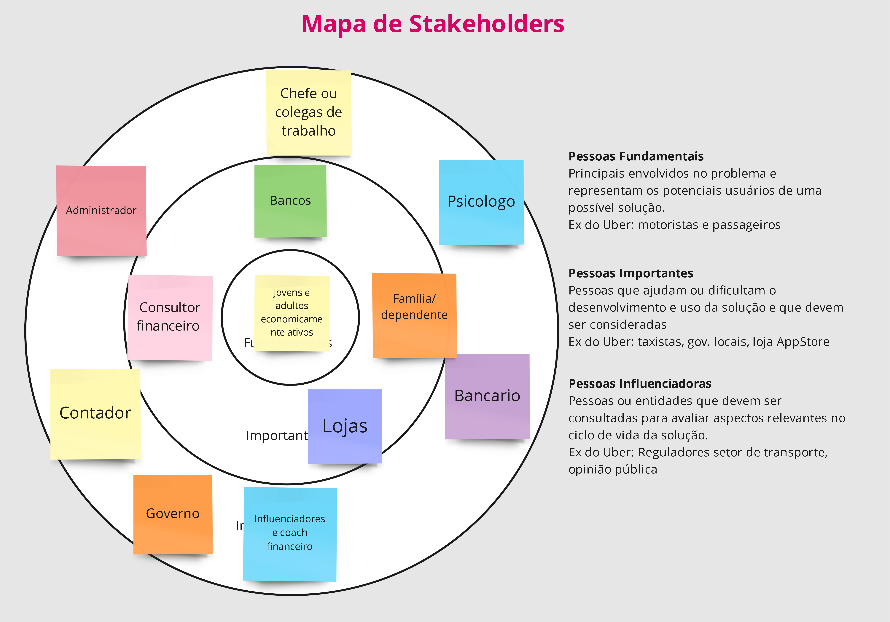
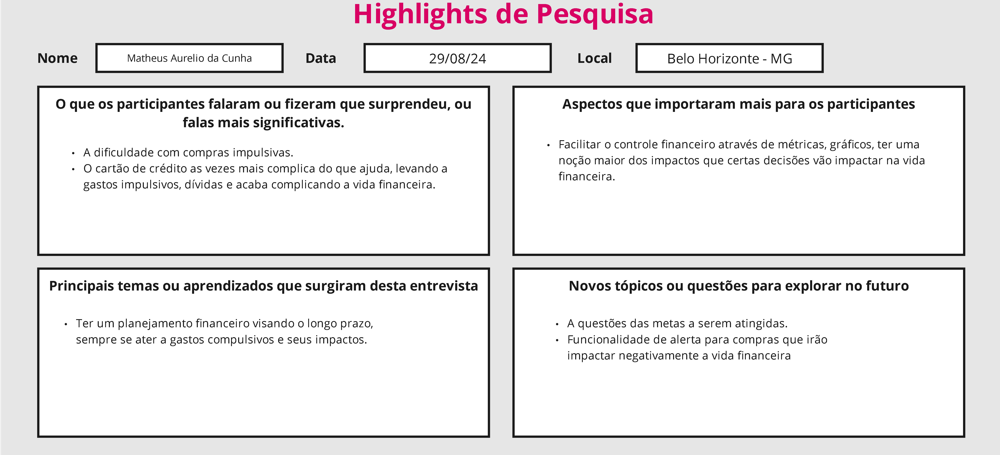
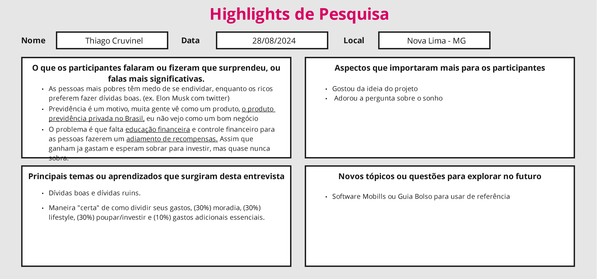
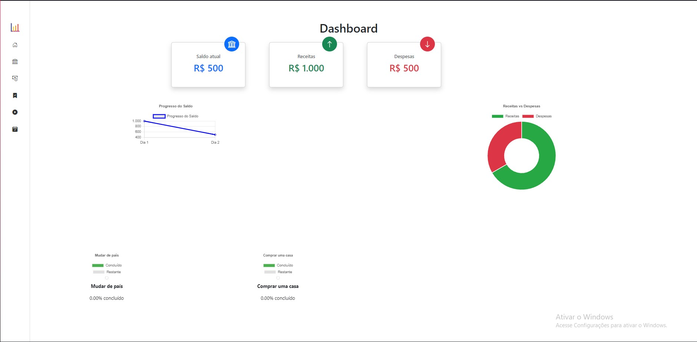
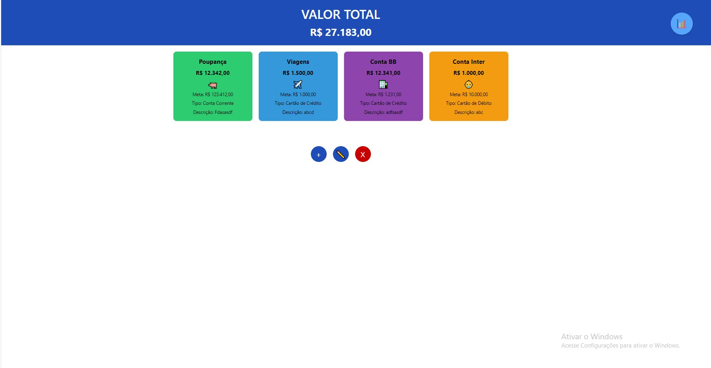
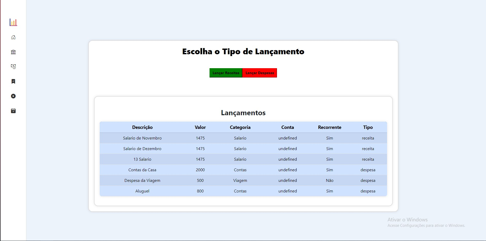
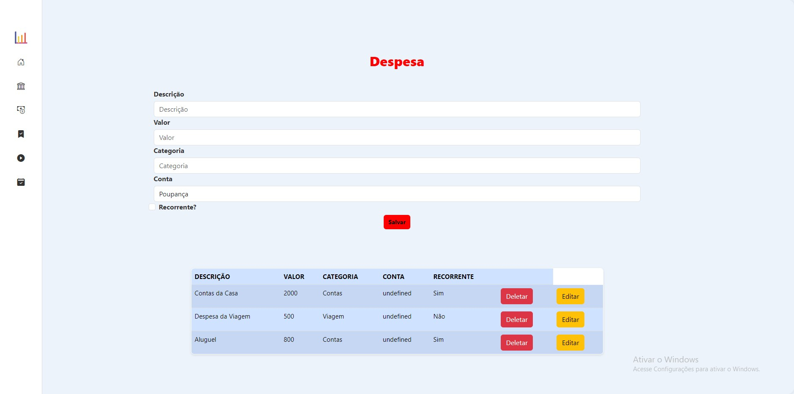
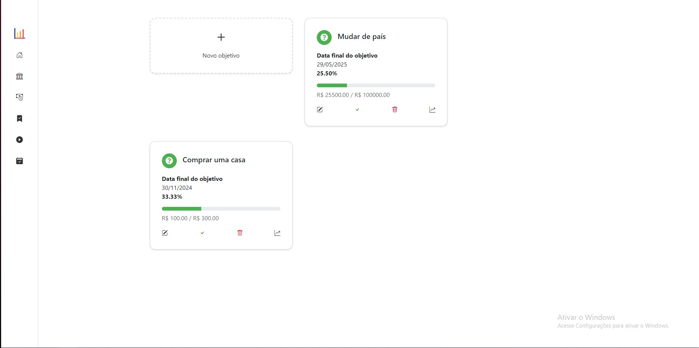
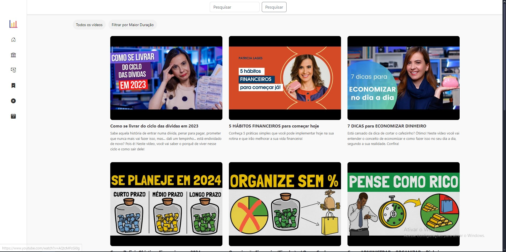
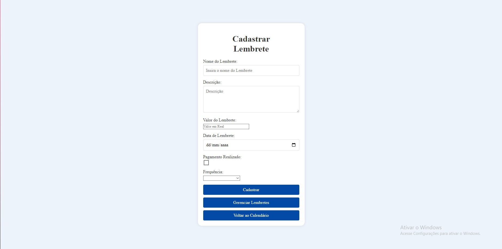

# Introdução

Informações básicas do projeto.

* **Projeto:**  Descontrole financeiro
* **Repositório GitHub:** https://github.com/ICEI-PUC-Minas-PMGCC-TI/ti-1-ppl-cc-m-20242-organizacao-financeira
* **Membros da equipe:**

  * Alessandro Andrade de Oliveira https://github.com/ale-andrade-o/ale-andrade-o
  * Pedro Henrique Cardoso Maia https://github.com/pedro-maia1337
  * André Almeida Costa https://github.com/And-30  
  * Davi Manoel Bernardes https://github.com/DaviManoelB
  * Tiago Santos Nogueira https://github.com/TiagoSNogueira
  * Felipe Quites Lopes https://github.com/FelipeQLopes
  

A documentação do projeto é estruturada da seguinte forma:

1. Introdução
2. Contexto
3. Product Discovery
4. Product Design
5. Metodologia
6. Solução
7. Referências Bibliográficas


# Contexto

## Problema

Quando as pessoas começam a ter sua própria renda, é comum enfrentarem dificuldades para se organizar e planejar de forma eficiente como gastar e administrar seu dinheiro. Nosso projeto busca oferecer uma solução que ajudará essas pessoas a gerenciar melhor suas finanças, indicando como e quando gastar, onde investir e como controlar os gastos excessivos.

## Objetivos

O objetivo deste projeto é oferecer uma solução prática e eficaz para pessoas que enfrentam dificuldades em gerenciar suas finanças pessoais. Através de ferramentas intuitivas e personalizáveis, o aplicativo auxilia no controle dos gastos, planejamento de orçamento, acompanhamento de investimentos e na tomada de decisões financeiras mais conscientes. Queremos proporcionar uma experiência que simplifique o gerenciamento financeiro, ajudando os usuários a alcançar maior estabilidade e bem-estar econômico.

## Justificativa

A motivação para trabalhar com essa aplicação vem da crescente necessidade de educação financeira e controle eficiente de gastos, especialmente com a expansão do consumo digital. Escolhemos esses objetivos específicos para ajudar as pessoas a tomar decisões financeiras mais conscientes e evitar dívidas. Aprofundamos em aspectos como planejamento de orçamento e controle de investimentos porque são áreas-chave para promover estabilidade e segurança financeira no dia a dia.

## Público-Alvo

O público-alvo do nosso projeto são pessoas que enfrentam dificuldades em controlar suas finanças, com idade entre 25 e 65 anos. Este grupo inclui indivíduos em diferentes fases da vida, desde jovens adultos que estão começando a lidar com responsabilidades financeiras até aqueles que buscam mais estabilidade e controle em suas finanças pessoais.

# Product Discovery

## Etapa de Entendimento

> * **Matriz CSD**: também conhecida por Matriz de Alinhamento, é uma ferramenta utilizada no Design Thinking para organizar informações e facilitar o processo de tomada de decisão e solução de problemas.
>

> * **Mapa de stakeholders**: ferramenta que nos permite compreender o grupo de pessoas e entidades que devemos estudar e conversar para entender mais sobre o problema.
> 

> * **Entrevistas qualitativas**: série de entrevistas qualitativas para validar suposições e solucionar as dúvidas com as principais pessoas envolvidas.
>  

   
   
   
   
   
   
> * **Highlights de pesquisa**: um compilado do levantamento realizado por meio das entrevistas.
>  

   
   
   
   
   

## Etapa de Definição

### Personas

## Persona 1
 

 ## Persona 2
 

 ## Persona 3
 

# Product Design

## Histórias de Usuários

Com base na análise das personas foram identificadas as seguintes histórias de usuários:

| EU COMO                                                        | QUERO/PRECISO                                     | PARA                                                              |
| -------------------------------------------------------------- | --------------------------------------            | ----------------------------------------------------------------- |
| Alguém que sofre com dívidas                                   | Lembretes de vencimento de contas                 | Evitar pagar juros não essenciais                                 |
| Alguém que não tem muito tempo                                 | Painel de fluxo de caixa com relatórios visuais   | Gastar menos tempo organizando minhas finanças                    |
| Alguém desorganizado                                           | Painel de fluxo de caixa com gastos classificados | Saber as minhas maiores fontes de gastos                          |
| Alguém sem conhecimento de finanças pessoais                   | Dicas e aulas sobre finanças                      | Viver uma vida confortavel sem se preocupar com dinheiro          |
| Alguém que compra muito parcelado                              | Gráfico com o valor dos juros mensais             | Saber quanto estou gastando a mais em um produto                  |
| Alguém que quer viajar                                         | Registro de quanto estou juntando                 | Saber em quanto tempo vou ter o dinheiro suficiente               |
| Alguém que gastar valores muitos altos                         | Registrar quando gasta muito                      | Alerta quando o gasto esta muito alto                             |
| Usa muito cartão                                               | Colocar apelidos nos estabelecimentos na fatura   | Identificar de forma mais fácil na fatura qual foi o gasto e onde |
| Quero registrar e categorizar meus gastos diários facilmente   |Ferramentas de controle                            | Poder ter um maior controle do gasto mensal                       |

## Proposta de Valor

## Proposta da Persona 1


## Proposta da Persona 2


## Proposta da Persona 3


## Requisitos

As tabelas que se seguem apresentam os requisitos funcionais e não funcionais e restrições que detalham o escopo do projeto.

### Requisitos Funcionais


| ID      | Descrição dos Requisitos                                                                                                | Prioridade|
| ------  | ----------------------------------------------------------------------------------------------------------------------|-----------|
| RF-001  | O sistema deverá manter registro da entrada e saída do dinheiro mensal                                                | ALTA      |
| RF-002  | O sistema deverá mostra um relatório com todo o gasto e lucro do usuário em cada mês                                  | ALTA      |
| RF-003  | O sistema deverá ter um grafico de juros para saber quanto do valor do produto está sendo cobrado a mais              | MÉDIA     |
| RF-004  | O sistema deverá ter um calendário para lembrar o usuário do vencimento de contas cadastradas                         | ALTA      |
| RF-005  | O sistema deverá permitir colocar um nome fantasia na fatura do estabelecimento para ter uma identificação facilitada | MÉDIA     |
| RF-006  | Um sistema de cofre para saber quando uma meta específica será alcançada                                              | MÉDIA     |
| RF-007  | O sistema deverá ter uma divisão para cada tipo de gastos para maior organização financeira                           | ALTA      |
| RF-008  | O sitema deverá ter alertas quando um tipo de gasto esta alto                                                         | MÉDIA     |
| RF-009  | O sitema deverá ter acesso a conteúdos sobre educação financeira                                                      | MÉDIA     |
| RF-010  | O sistema deverá ter uma calculadora para mostra o gastos pro divida em cada mês.                                     | MÉDIA     |

### Requisitos não Funcionais


| ID      | Descrição dos Requisitos Não Funcionais                                                                       | Prioridade |
| ------- | ------------------------------------------------------------------------------------------------------------- | ---------- |
| RNF-001 | O aplicativo deve estar disponível tanto para versão web quanto para versão mobile                            | MÉDIA      |
| RNF-002 | O aplicativo deve ser capaz decarregar a página principal com resumo financeiro do usuário en até 2 segundos  | MÉDIA      |


### Restrições do Projeto


| ID      | Descrição das Restrições                                                                        | Prioridade |
| ------- | ----------------------------------------------------------------------------------------------- | ---------- |
| RE-001  | O usuário só pode criar um número limitado de categorias de gastos (por exemplo, no máxomp 30)  | MÉDIA      |
| RE-002  | O aplicativo pode impor uma restrição de gasto diário                                           | MÉDIA      |

## Projeto de Interface

Artefatos relacionados com a interface e a interacão do usuário na proposta de solução.

### Wireframes


### User Flow


Para uma melhor visualização do User Flow acesse esse link: https://miro.com/app/board/uXjVLdtXMKg=/

### Protótipo Interativo


✅ [Protótipo Interativo (MarvelApp)](https://marvelapp.com/prototype/fe0ehf8)  


# Metodologia

Detalhes sobre a organização do grupo e o ferramental empregado.

## Ferramentas

Relação de ferramentas empregadas pelo grupo durante o projeto.

| Ambiente                    | Plataforma | Link de acesso                                                                        |
| --------------------------- | ---------- | --------------------------------------------------------------------------------------|
| Processo de Design Thinking | Miro       | https://miro.com/app/board/uXjVKoWGKUQ=/                                              |
| Repositório de código       | GitHub     | https://github.com/ICEI-PUC-Minas-PMGCC-TI/ti-1-ppl-cc-m-20242-organizacao-financeira |
| Protótipo Interativo        | MarvelApp  | https://marvelapp.com/prototype/fe0ehf8                                               |
|                             |            |                                                                                       |

## Gerenciamento do Projeto

Divisão de papéis no grupo e apresentação da estrutura da ferramenta de controle de tarefas (Kanban).


# Solução Implementada

Esta seção apresenta todos os detalhes da solução criada no projeto.

## Vídeo do Projeto

O vídeo a seguir traz uma apresentação do problema que a equipe está tratando e a proposta de solução. ⚠️ EXEMPLO ⚠️

[](https://www.youtube.com/embed/70gGoFyGeqQ)

> ⚠️ **APAGUE ESSA PARTE ANTES DE ENTREGAR SEU TRABALHO**
>
> O video de apresentação é voltado para que o público externo possa conhecer a solução. O formato é livre, sendo importante que seja apresentado o problema e a solução numa linguagem descomplicada e direta.
>
> Inclua um link para o vídeo do projeto.

## Funcionalidades

Esta seção apresenta as funcionalidades da solução.Info

##### Funcionalidade 1 - DashBord 

Permite ao usuário acompanhar os gastos com despesas e os ganhos com receitas.

* **Estrutura de dados:** [DashBord](#ti_ed_contatos)
* **Instruções de acesso:**
  * Abra o site 
  * Acesse o menu principal 
  
* **Tela da funcionalidade**:



##### Funcionalidade 2 - Cateiras 

Permite ao usuário criar Cateiras para ter um controle do gasto.

* **Estrutura de dados:** [Cateiras](#ti_ed_contatos)
* **Instruções de acesso:**
  * Acessar a Tela de Carteiras  
  
* **Tela da funcionalidade**:



* ** Cadastro de Carteira
  

##### Funcionalidade 3 - Lançamentos 

Permite ao usuário vizualir as receitas e despesas cadastradas.

* **Estrutura de dados:** [Lançamentos](#ti_ed_contatos)
* **Instruções de acesso:**
  * Acessar a Tela de Lançamentos  
  
* **Tela da funcionalidade**:



* ** Cadastro de Receitas
  
* ** Cadastro de Despesas
  

##### Funcionalidade 4 - Objetivos 

Permite ao usuário visualizar os objetivos que foram cadastrados e acompanhar o progresso.

* **Estrutura de dados:** [Objetivos](#ti_ed_contatos)
* **Instruções de acesso:**
  * Acessar a Tela de Objetivos  
  
* **Tela da funcionalidade**:



##### Funcionalidade 5 - Tutoriais 

Permite ao usuário ter acesso a conteúdos de dados para melhorar seus conhecimentos econômicos.

* **Estrutura de dados:** [Tutoriais](#ti_ed_contatos)
* **Instruções de acesso:**
  * Acessar a Tela de Tutoriais  
  
* **Tela da funcionalidade**:



##### Funcionalidade 6 - Lembretes 

Permite ao usuário salvar lembretes para datas específicas.

* **Estrutura de dados:** [Lembretes](#ti_ed_contatos)
* **Instruções de acesso:**
  * Acessar a Tela de Lembretes  
  
* **Tela da funcionalidade**:


* ** Cadastro de Lembretes
  

## Estruturas de Dados

Descrição das estruturas de dados utilizadas na solução com exemplos no formato JSON.Info

##### Estrutura de Dados 

```json
 {
  "usuarios": [
    {
      "id": "1",
      "login": "admin",
      "senha": "123",
      "nome": "Administrador do Sistema",
      "email": "admin@abc.com"
    },
    {
      "id": "2",
      "login": "user",
      "senha": "123",
      "nome": "Usuario Comum",
      "email": "user@abc.com"
    },
    {
      "login": "rommel",
      "senha": "123",
      "nome": "Rommel",
      "email": "rommel@gmail.com",
      "id": "3"
    }
  ],
  "carteiras": [
    {
      "nomeConta": "Poupança",
      "saldo": 12342,
      "descricaoConta": "Fdasasdf",
      "meta": 123412,
      "tipo": "Conta Corrente",
      "detalhes": "Ola",
      "id_icone": "🐖",
      "id_cor": "#2ecc71",
      "id": "58a2"
    },
    {
      "nomeConta": "Viagens",
      "saldo": 1000,
      "descricaoConta": "abcd",
      "meta": 1000,
      "tipo": "Cartão de Crédito",
      "detalhes": "abcd",
      "id_icone": "✈️",
      "id_cor": "#3498db",
      "id": "qGCgG4P"
    },
    {
      "nomeConta": "Conta BB",
      "saldo": 12341,
      "descricaoConta": "adfsasdf",
      "meta": 1231,
      "tipo": "Cartão de Crédito",
      "detalhes": "afdsfa",
      "id_icone": "🏦",
      "id_cor": "#8e44ad",
      "id": "j02UVIb"
    },
    {
      "nomeConta": "Conta Inter",
      "saldo": 1000,
      "descricaoConta": "abc",
      "meta": 10000,
      "tipo": "Cartão de Débito",
      "detalhes": "abcd",
      "id_icone": "👶",
      "id_cor": "#f39c12",
      "id": "65AwP8H"
    }
  ],
  "categorias": [
    {
      "id": "1",
      "nome": "Alimentação"
    },
    {
      "id": "2",
      "nome": "Vestuário"
    },
    {
      "id": "3",
      "nome": "Lazer"
    },
    {
      "id": "4",
      "nome": "Transporte"
    },
    {
      "id": "5",
      "nome": "Saúde"
    },
    {
      "id": "6",
      "nome": "Educação"
    },
    {
      "id": "7",
      "nome": "Moradia"
    },
    {
      "id": "8",
      "nome": "Entretenimento"
    },
    {
      "id": "9",
      "nome": "Trabalho"
    },
    {
      "id": "10",
      "nome": "Pessoal"
    },
    {
      "id": "11",
      "nome": "Financeiro"
    },
    {
      "id": "12",
      "nome": "Contas"
    }
  ],
  "tutoriais": [
    {
      "url": "https://www.youtube.com/watch?v=AQtcMFcGi0g",
      "titulo": "Como se livrar do ciclo das dívidas em 2023",
      "descricao": "Sabe aquela história de entrar numa dívida, penar para pagar, prometer que nunca mais vai fazer isso, mas... dali um tempinho... está endividado de novo? Pois é! Neste vídeo, você vai saber o porquê de viver nesse ciclo e como sair dele! ",
      "youtubeId": "AQtcMFcGi0g",
      "duracao": "20",
      "id": 11
    },
    {
      "url": "https://www.youtube.com/watch?v=S5psBbzm6HU",
      "titulo": "5 HÁBITOS FINANCEIROS para começar hoje",
      "descricao": "Conheça 5 práticas simples que você pode implementar hoje na sua rotina e que irão melhorar a sua vida financeira! ",
      "youtubeId": "S5psBbzm6HU",
      "duracao": "14",
      "id": 12
    },
    {
      "url": "https://www.youtube.com/watch?v=KVdKT5C5f04",
      "titulo": "7 DICAS para ECONOMIZAR DINHEIRO",
      "descricao": "Está cansado da dica de cortar o cafezinho? Ótimo! Neste vídeo você vai entender o conceito de economizar e como fazer isso no seu dia a dia, segundo a sua realidade. Confira!",
      "youtubeId": "KVdKT5C5f04",
      "duracao": "13",
      "id": 13
    },
    {
      "url": "https://www.youtube.com/watch?v=CPeQs7CAaZQ",
      "titulo": "Como Definir Objetivos Financeiros em 2024 - Educação Financeira Ilustrada",
      "descricao": "Entenda como planejar suas finanças com os \"potes financeiros\" de reserva de emergência, reserva pessoal e investimentos de longo prazo.",
      "youtubeId": "CPeQs7CAaZQ",
      "duracao": "9",
      "id": 14
    },
    {
      "url": "https://www.youtube.com/watch?v=AfMGeMZmyUU",
      "titulo": "Organização Financeira (Simples) p/ Quem Ganha Pouco",
      "descricao": "Aprenda organização financeira de uma forma simples e fácil!",
      "youtubeId": "AfMGeMZmyUU",
      "duracao": "10",
      "id": 15
    },
    {
      "url": "https://www.youtube.com/watch?v=V7z5bC4GOQI",
      "titulo": "Como ADMINISTRAR e ORGANIZAR o Dinheiro (Métodos de Livros de Finanças)",
      "descricao": "Veja como administrar seu dinheiro de acordo com grandes livros de finanças pessoais!",
      "youtubeId": "V7z5bC4GOQI",
      "duracao": "9",
      "id": 16
    },
    {
      "url": "https://www.youtube.com/watch?v=o7BUfhgZb68",
      "titulo": "GUSTAVO CERBASI: OS MAIORES ERROS DA ORGANIZAÇÃO FINANCEIRA | Os Economistas 64",
      "descricao": "Neste episódio especial, temos a honra de receber Gustavo Cerbasi, grande autor e especialista em finanças pessoais, para discutir o tema \"Como Organizar sua vida financeira para Investir mais.\nNeste episódio, mergulharemos na organização financeira e como ela pode transformar sua vida. Gustavo Cerbasi, conhecido por sua abordagem prática, compartilhará suas melhores dicas e estratégias para que você possa criar uma base sólida para suas finanças pessoais e aproveitar ao máximo suas oportunidades de investimento.",
      "youtubeId": "o7BUfhgZb68",
      "duracao": "5",
      "id": 17
    },
    {
      "url": "https://www.youtube.com/watch?v=xIIa3A3kY-k",
      "titulo": "Como se organizar financeiramente: 7 passos para sair do caos financeiro 💸",
      "descricao": "Se você está cansado de ver seu dinheiro desaparecer sem saber para onde ele foi esse vídeo é pra você. Por que hoje, quero te mostrar 7 passos simples para você organizar seu dinheiro e ter uma vida financeira mais equilibrada.",
      "youtubeId": "xIIa3A3kY-k",
      "duracao": "14",
      "id": 18
    },
    {
      "url": "https://www.youtube.com/watch?v=jvJBjO24PVs",
      "titulo": "10 dicas para se organizar financeiramente em 2024!",
      "descricao": "No vídeo de hoje, trouxe 10 dicas para te ajudar a ficar no verde em 2024 e ser um orgulho da Nath Finanças!",
      "youtubeId": "jvJBjO24PVs",
      "duracao": "14",
      "id": 19
    },
    {
      "url": "https://www.youtube.com/watch?v=Vi7sSRi_3ao",
      "titulo": "10 PASSOS para PLANEJAMENTO FINANCEIRO FÁCIL e SIMPLES | Minimalismo | Educação Financeira",
      "descricao": "10 PASSOS para PLANEJAMENTO FINANCEIRO FÁCIL e SIMPLES | Minimalismo | Educação Financeira",
      "youtubeId": "Vi7sSRi_3ao",
      "duracao": "14",
      "id": 20
    },
    {
      "url": "https://www.youtube.com/watch?v=HzRK6wTSHHU",
      "titulo": "Educação Financeiro – Educação Financeira Para Iniciante!",
      "descricao": "Olá pessoal, tudo bem! No vídeo de hoje falaremos um pouco de educação financeira para iniciantes.\nNesse vídeo você irá saber tudo sobre educação financeira, e como usar a educação financeira para garantir um futuro próspero.",
      "youtubeId": "HzRK6wTSHHU",
      "duracao": "5",
      "id": 21
    }
  ],
  "lancamentos": [
    {
      "descricao": "sdadaada",
      "valor": 1000,
      "categoria": "aaaaa",
      "id_carteira": "qGCgG4P",
      "recorrente": false,
      "tipo": "receita",
      "id": 9
    },
    {
      "descricao": "teste2",
      "valor": 500,
      "categoria": "abcd",
      "id_carteira": "qGCgG4P",
      "recorrente": false,
      "tipo": "despesa",
      "id": 10
    }
  ],
  "objetivos": [
    {
      "nome": "Mudar de país",
      "valor": 100000,
      "valorInicial": 25500,
      "data": "2025-05-30",
      "cor": "#4caf50",
      "descricao": "Me mudar para suíça",
      "icone": "fas fa-question-circle",
      "depositos": [
        {
          "id": 1733582532265,
          "valor": 500,
          "data": "2024-12-14"
        },
        {
          "id": 1733667539612,
          "valor": 20000,
          "data": "2024-12-04"
        }
      ],
      "id": 22
    },
    {
      "nome": "Comprar uma casa",
      "valor": 300,
      "valorInicial": 100,
      "data": "2024-12-01",
      "cor": "#4caf50",
      "descricao": "Comprar uma casa",
      "icone": "fas fa-question-circle",
      "depositos": [],
      "id": 23
    }
  ],
  "tipos_de_objetivos": [
    {
      "id": "1",
      "nome": "Comprar um Carro"
    },
    {
      "id": "2",
      "nome": "Viajar para a Europa"
    },
    {
      "id": "3",
      "nome": "Comprar uma Casa"
    },
    {
      "id": "4",
      "nome": "Fundo de Emergência"
    },
    {
      "id": "5",
      "nome": "Educação Superior"
    },
    {
      "id": "6",
      "nome": "Aposentadoria"
    }
  ],
  "lembretes": [
    {
      "titulo": "adadasd",
      "descricao": "dada",
      "valor": 6,
      "data": "2024-12-11",
      "status": false,
      "frequencia": "null",
      "id": 1
    }
  ]
}
  
```
## Módulos e APIs

Esta seção apresenta os módulos e APIs utilizados na solução

**Scripts:**
* Bootstrap 4 - [http://getbootstrap.com/](http://getbootstrap.com/) 

# Referências

As referências utilizadas no trabalho foram:

Marak, Zericho R., and Deepa Pillai. "Factors, outcome, and the solutions of supply chain finance: review and the future directions." Journal of Risk and Financial Management 12.1 (2018): 3.
MARAK, Zericho R.; PILLAI, Deepa. Factors, outcome, and the solutions of supply chain finance: review and the future directions. Journal of Risk and Financial Management, v. 12, n. 1, p. 3, 2018.
Marak, Z. R., & Pillai, D. (2018). Factors, outcome, and the solutions of supply chain finance: review and the future directions. Journal of Risk and Financial Management, 12(1), 3.

Benartzi, Shlomo. Save more tomorrow: Practical behavioral finance solutions to improve 401 (k) plans. Penguin, 2012.
BENARTZI, Shlomo. Save more tomorrow: Practical behavioral finance solutions to improve 401 (k) plans. Penguin, 2012.
Benartzi, S. (2012). Save more tomorrow: Practical behavioral finance solutions to improve 401 (k) plans. Penguin.

Asutay, Mehmet. "Conceptualisation of the second best solution in overcoming the social failure of Islamic finance: Examining the overpowering of homoislamicus by homoeconomicus." IIUM Journal in Economics and Management 15.2 (2007): 167-195.
ASUTAY, Mehmet. Conceptualisation of the second best solution in overcoming the social failure of Islamic finance: Examining the overpowering of homoislamicus by homoeconomicus. IIUM Journal in Economics and Management, v. 15, n. 2, p. 167-195, 2007.
Asutay, M. (2007). Conceptualisation of the second best solution in overcoming the social failure of Islamic finance: Examining the overpowering of homoislamicus by homoeconomicus. IIUM Journal in Economics and Management, 15(2), 167-195.

> - [Cuso de Node](https://youtube.com/playlist?list=PLJ_KhUnlXUPtbtLwaxxUxHqvcNQndmI4B&si=ByTd5-kOXJh3ROou)
> - [Crud](https://blog.geekhunter.com.br/criar-crud-node-js/)
> - [Formato ABNT](https://www.normastecnicas.com/abnt/trabalhos-academicos/referencias/)
> - [Referências Bibliográficas da ABNT](https://comunidade.rockcontent.com/referencia-bibliografica-abnt/)
